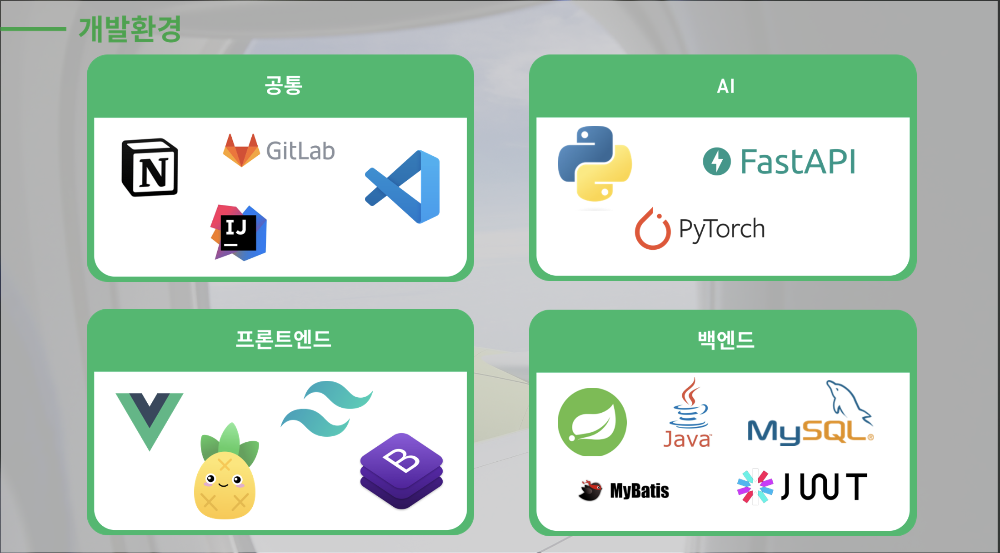

# YJ Trip 🛫

<h3>통합 여행 정보 제공 서비스 YJTrip</h3>

### 📜 목차
---
1. [**프로젝트 일정**](#1)
2. [**서비스 소개**](#2)
3. [**주요 기능**](#3)
4. [**기술 스택**](#4)
5. [**산출물**](#5)
6. [**팀원 소개**](#6)
7. [**소감**](#7)

### 🗓️ 프로젝트 일정
---
- 일정: 2024년 5월 16일 - 2024년 5월 23일

### 🔎 서비스 소개
---
KakaoMap과 공공데이터를 기반으로 만들어진 웹 서비스 **YJTrip**

여행 계획을 만들고, 핫플레이스 등록을 할 수 있으며 여행&관광지와 관련된 다양한 정보를 얻을 수 있는 웹사이트 입니다.

#### 사이트맵

### 🔎 주요 기능
---

1. 회원관리
    - 회원 관리 : 회원가입, 수정, 조회, 탈퇴
    - 로그인 관리 : 로그인, 로그아웃
2. 게시판 관리
    - 공지사항 : 공지사항 등록, 수정, 삭제, 조회
    - Q&A : Q&A 등록, 수정, 삭제, 조회
3. 공유 게시판 관리
    - 회원 주도의 hotplace 등록 : 지도와 사진을 활용한 hotplace 등록
4. 관광지 정보 조회
    - 지역별 관광지 정보 수집 : 한국관광공사 : 지역별 관광지 정보를 얻어와 화면에 표시
    - 관광지, 숙박, 음식점 조회 : 관광지 정보를 지역별 원하는 컨텐츠별 조회 (youtube api, naver 크롤링)
    - 문화시설, 공연, 여행코스, 쇼핑 조회 : 관광지 정보를 지역별 원하는 컨텐츠별 조회 (youtube api, naver 크롤링)
5. 여행 계획 관리
    - 여행 계획 경로 설정 : 조회한 관광지를 활용하여 여행 계획, 여행 경로를 저장
6. 여행지 추천 서비스
    - 여행지 추천 : 생성형 AI를 통한 키워드에 따른 여행지 추천
7. 부가 기능
    - AI를 이용한 욕설 필터링 기능
    - 챗봇 기능 (sendbird api)

### ⚒️ 기술 스택
---

 

### 📜 산출물
---
#### 프로젝트 시연 영상

<video width="600" controls>
  <source src="./presentation/project시연영상.mp4" type="video/mp4">
  Your browser does not support the video tag.
</video>

#### ppt 발표자료
[여기에서 ppt자료를 보실 수 있습니다.](./presentation/YJTrip_최종발표.pptx)

### 👥 팀원 소개

  
  

### 🔊 프로젝트 소감
**박지용**

한 학기 동안 배운 것을 잘 녹여낼 수 있는 프로젝트라고 생각한다. 구현하고 싶었던 기능이나 디자인 요소 등이 많았는데, 생각보다 프로젝트 기간이 짧게 느껴져서 아쉬움이 남는다. 그래도 팀원이 잘 따라와주고 협업도 순탄하게 잘 진행되어 큰 어려움 없이 프로젝트를 마무리 한 것 같다.

**선예림**

프론트엔드와 백엔드 모두 짧은 시간 내에 구현해내아되어 걱정이 앞섰지만, jwt와 같은 기술들도 사용해보고 그간 배웠던 기술들을 적용해 볼 수 있어 유익했다. 
무엇보다 적절한 역할 분담으로 초반에 기획했던 것들을 모두 개발해내 뿌듯했고, 궁금한 부분이 생기면 도움을 준 팀원한테도 고맙다.
